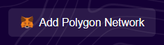

# Metamask

In order to use Sigma Squared, you need a browser injected wallet such as Metamask.  You can learn more about Metamask and install the browser extension [here](https://metamask.io/).

Once you have Metamask installed, you need to add the Polygon network to it.  You can go to the [Polyscan website](https://polygonscan.com/) and click "Add Polygon Network".

You can also manually add the network in Metamask settings.
